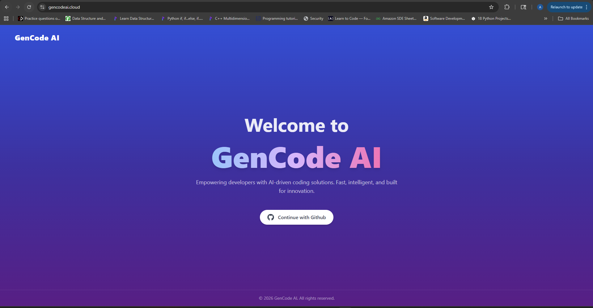
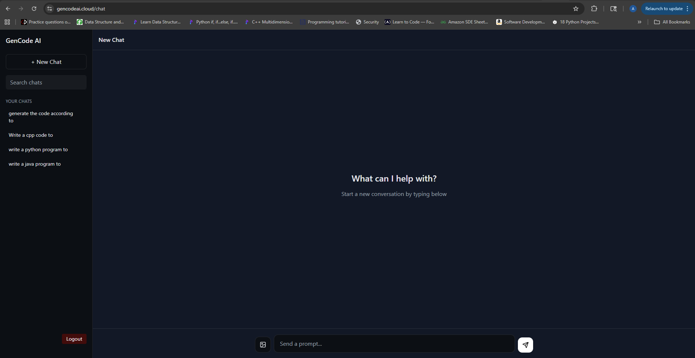
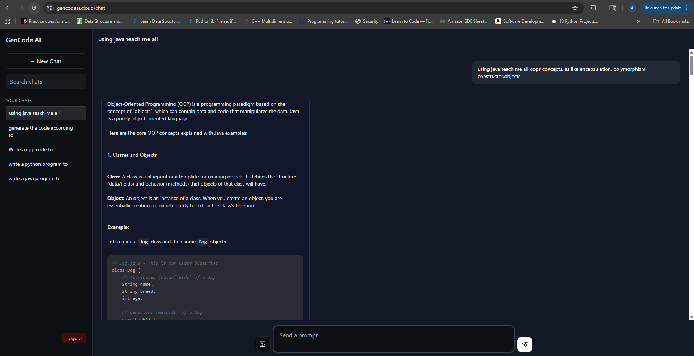
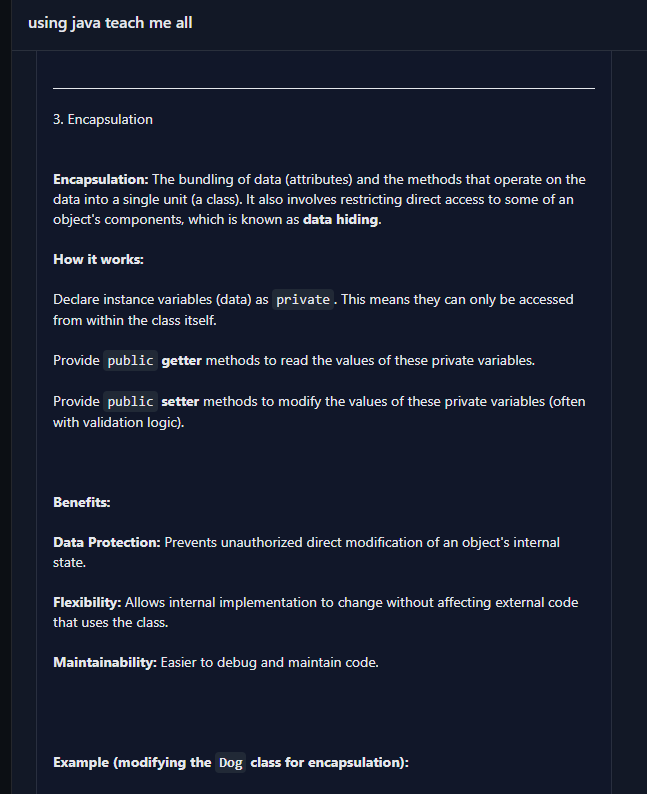
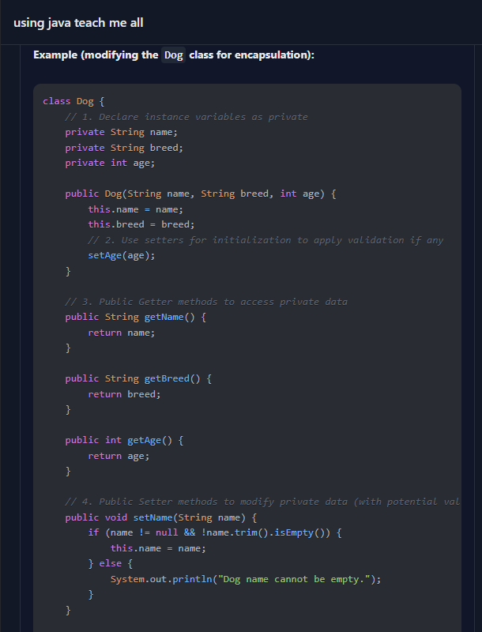
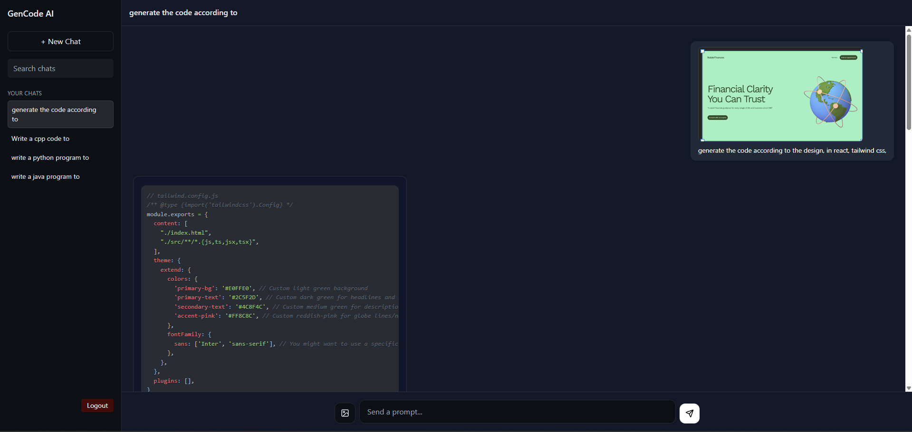

# AI Code Generation & Review Platform

An AI-powered developer productivity platform that generates, analyzes, and reviews code from text prompts and images.

##  Overview

This project is a full-stack AI-powered platform designed to enhance developer productivity by enabling:

- Code generation from natural language prompts
- Code generation from images (handwritten or screenshots)
- Intelligent code review and feedback
- Multi-language and framework support

The platform integrates modern AI capabilities with a scalable full-stack architecture using React, Spring Boot, and MongoDB.

##  Live Demo

🔗 https://gencodeai.cloud/

> ⚠️ Note: The application may take a few seconds to load due to cold starts (if applicable).

## Features

-  AI Code Generation from Text Prompts
-  AI Code Generation from Images
-  Automated Code Review System
-  Multi-language Support (C++, Java, Python, JavaScript)
-  Framework Support (React, Node.js, Spring Boot, Django)
-  Secure Authentication with GitHub OAuth
-  Access Token & Refresh Token-based Authorization
-  Real-time-like AI response handling

##  Tech Stack

### Frontend
- React
- Context API (state management)
- Tailwind CSS

### Backend
- Spring Boot
- Spring Security
- REST APIs

### Database
- MongoDB

### Authentication
- GitHub OAuth
- JWT (Access + Refresh Tokens)

### AI Integration
- Gemini flash 2.5

##  Project Structure

gencode-ai/
│
├── frontend/        # React application
├── backend/         # Spring Boot application
├── docker-compose.yml/ #docker compose file
└── README.md

##  System Architecture

This platform is designed with a scalable, production-ready architecture:

- **Frontend (React)** communicates with backend APIs
- **NGINX** acts as a reverse proxy for routing requests
- **Spring Boot Backend** handles business logic and AI integration
- **RabbitMQ** enables asynchronous processing of AI tasks
- **Redis** is used for caching and rate limiting API requests
- **WebSockets** provide real-time communication for AI responses
- **MongoDB** stores user data and generated code history

### Flow:
1. User sends prompt/image from frontend
2. Request goes through NGINX → Backend
3. Backend pushes heavy tasks to RabbitMQ
4. Worker processes AI request asynchronously
5. Response is streamed back via WebSocket

##  Deployment & DevOps

- Containerized using **Docker**
- Deployed on **AWS**
- **NGINX** used as reverse proxy
- **Redis** for caching and rate limiting
- **RabbitMQ** for asynchronous task processing
- Environment-based configuration using `.env`

##  Why This Project?

Modern developers rely heavily on AI-assisted tools like GitHub Copilot.  
This project replicates and extends similar capabilities by combining:

- AI-powered code generation
- Multi-language support
- Real-time feedback systems
- Scalable backend architecture

It demonstrates the ability to design and build systems that handle:
- Asynchronous workflows
- Real-time communication
- Secure authentication
- Production-level deployment

## 📸 Screenshots

### 🏠 Landing Page
Clean and intuitive entry point for users to interact with the platform.

---

### 💬 Chat Interface
Interactive chat-based UI for communicating with the AI system.

---

### 🧠 Text to Code Generation
Generate production-ready code using natural language prompts.

---

### 📖 Code Explanation
Understand generated code with AI-powered explanations.

---

### 📊 Code Quality Review
Analyze code quality and receive structured feedback.

---

### 🖼️ Image to Code Generation
Convert images (handwritten or screenshots) into working code.

